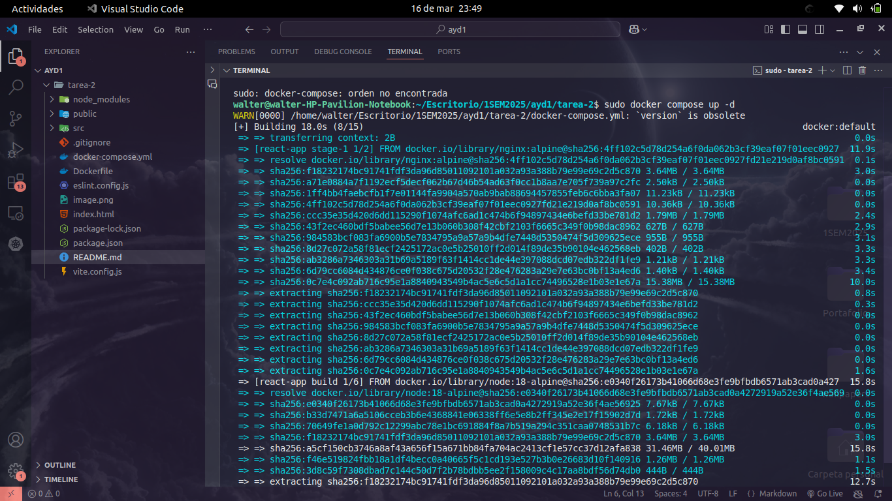
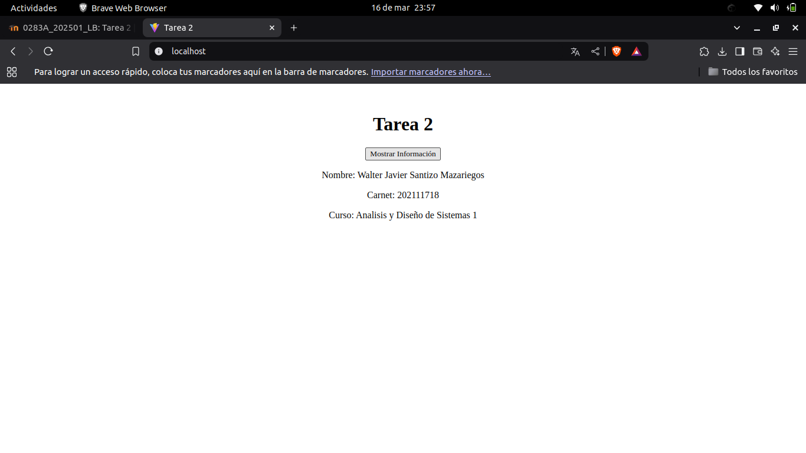

# Tarea 2


# Iniciamos el proyecto en React

Iniciamos nuestro proyecto en React con

```bash
npm create vite@latest tarea-2 --template react
cd tarea-2
npm install
```

# Creamos el Dockerfile

`Dockerfile` construye y despliega una aplicación en React utilizando Docker. 


### **1. Construcción de la aplicación con Node.js**

```dockerfile
# Usa Node.js 18 en Alpine Linux para reducir el tamaño de la imagen
FROM node:18-alpine AS build
```
- Usa una imagen ligera de Node.js basada en Alpine Linux.
- La etiqueta `AS build` indica que esta es una etapa de construcción.

```dockerfile
# Define el directorio de trabajo dentro del contenedor
WORKDIR /app
```
- Crea y establece `/app` como el directorio de trabajo dentro del contenedor.

```dockerfile
# Copia los archivos del package.json y package-lock.json
COPY package.json package-lock.json ./
```
- Copia los archivos que contienen las dependencias para evitar reinstalar innecesariamente paquetes si el código no ha cambiado.

```dockerfile
# Instala las dependencias del proyecto
RUN npm install
```
- Instala todas las dependencias definidas en `package.json`.

```dockerfile
# Copia todos los archivos del proyecto al contenedor
COPY . .
```
- Copia el código fuente completo de la aplicación React al contenedor.

```dockerfile
# Construye la aplicación
RUN npm run build
```
- Genera los archivos optimizados de producción dentro de la carpeta `dist/`.

---

### **2. Despliegue con Nginx**

```dockerfile
# Usa una imagen de Nginx basada en Alpine Linux para servir la app
FROM nginx:alpine
```
- Cambia a una imagen de Nginx ligera para servir los archivos estáticos de React.

```dockerfile
# Copia los archivos construidos en la etapa anterior a la carpeta de Nginx
COPY --from=build /app/dist /usr/share/nginx/html
```
- Toma los archivos de `dist/` generados en la etapa de construcción y los coloca en el directorio que Nginx usa para servir contenido estático.

```dockerfile
# Expone el puerto 80 para acceder a la aplicación
EXPOSE 80
```
- Indica que el contenedor servirá la aplicación en el puerto 80.

```dockerfile
# Comando por defecto para iniciar Nginx
CMD ["nginx", "-g", "daemon off;"]
```
- Inicia Nginx y mantiene el proceso en ejecución.

# Docker Compose

creamos el docker compose para automatizar el build y el despliegue especificamos la version y el mapeo de puerto virtual al local





# Verificacion 

En el navegador colocamos `localhost:80` para verificar que la imagen de docker este corriendo correctamente


